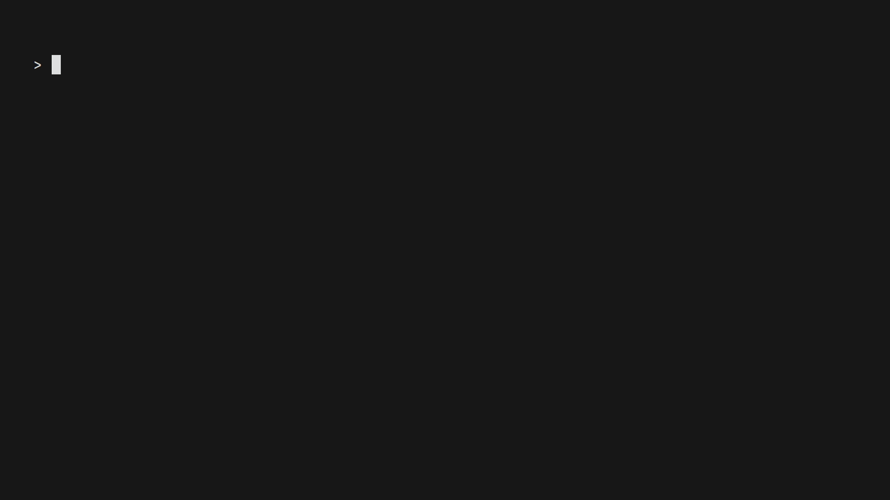

# Crust Programming Language
A language written in the Rust Programming Language.

# DONE:
- Interpreter

# TODO:
- Typed and Untyped AST
- Bytecode IR
- Bytecode VM Backend
- LLVM Backend with Inkwell

# Basic Demo

